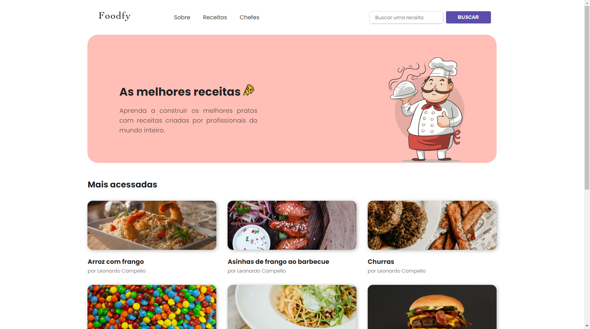
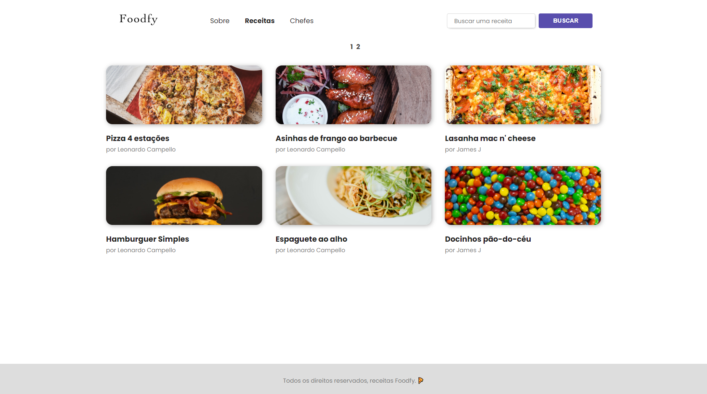
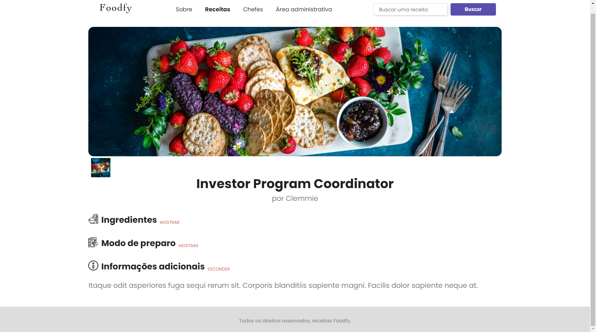
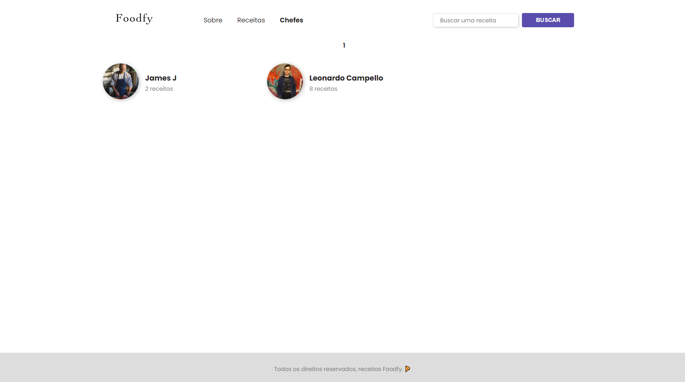
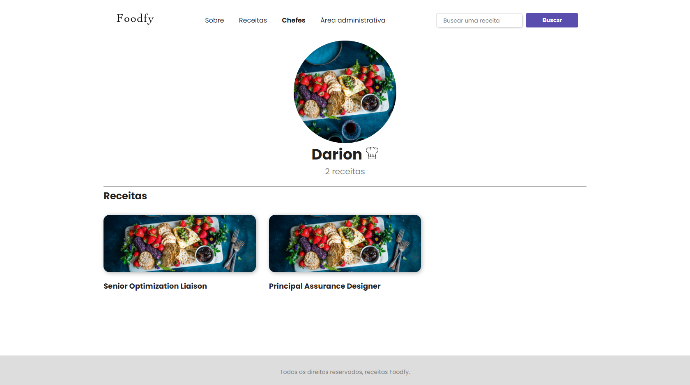
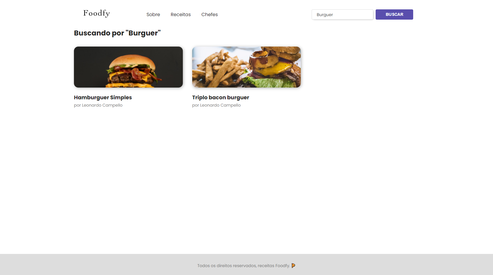
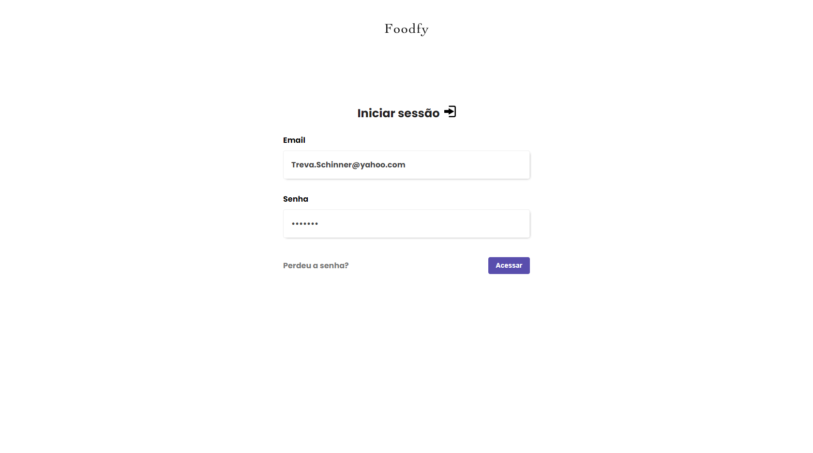
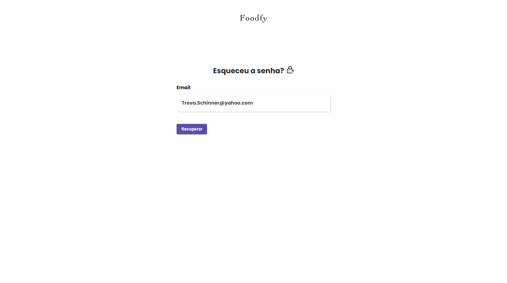
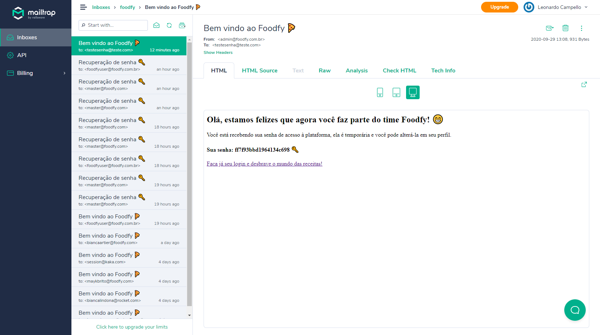

<h1 align="center">
    
</h1>

<h1 align="center"> Foodfy 🍝 </h1>


## 📌 Resources 

- 👨‍🍳 Explore recipes and find amazing chefs.
- 🦸‍♂️ Admin mode.

## 🚀 Technologies used

The following technologies were used

- [x] [JavaScript](https://developer.mozilla.org/pt-BR/docs/Web/JavaScript)
- [x] [Node.js](https://nodejs.org/en/)
- [x] [PostgreSQL](https://www.postgresql.org/)

### 📜 **Libraries**

- [x] [browsersync](https://www.browsersync.io/)
- [x] [npm-run-all](https://www.npmjs.com/package/npm-run-all)
- [x] [method-override](https://www.npmjs.com/package/method-override)
- [x] [node-postgres](https://www.npmjs.com/package/pg) 
- [x] [nodemon](https://www.npmjs.com/package/nodemon) 
- [x] [multer](https://www.npmjs.com/package/multer)
- [x] [nodemailer](https://nodemailer.com/about/) 
- [x] [express-session](https://www.npmjs.com/package/express-session) 
- [x] [lottie web](https://github.com/airbnb/lottie-web)

## 🎨 Layout

**Home** 🏠



---

**Recipes** 🥘



---

**Recipe** 🍝



---

**Chefs** 👩‍🍳👨‍🍳



---

**Chef** 👨‍🍳



---

**Filter** 🔎



---

**Login** ✅



---

**Forgot password** 🔑



---

**Sending emails** 📩



---

**Success / error messages** ❌


---

**GIF demonstration** 🎥


---

## Project installation 👷‍♂️

First you need to have [Node.js](https://nodejs.org/en/) installed, then **run the following command:**

``` bash 
## To clone the project
git clone https://github.com/LeonardoCampello-dev/Foodfy.git
```

``` bash 
## To install the dependencies
npm install
```

``` bash 
## Running project
npm start
```

---

## 📜 License 

Released in 2020. This project is under the [MIT license](/LICENSE).

## Made with love by Leonardo Campello 💚 